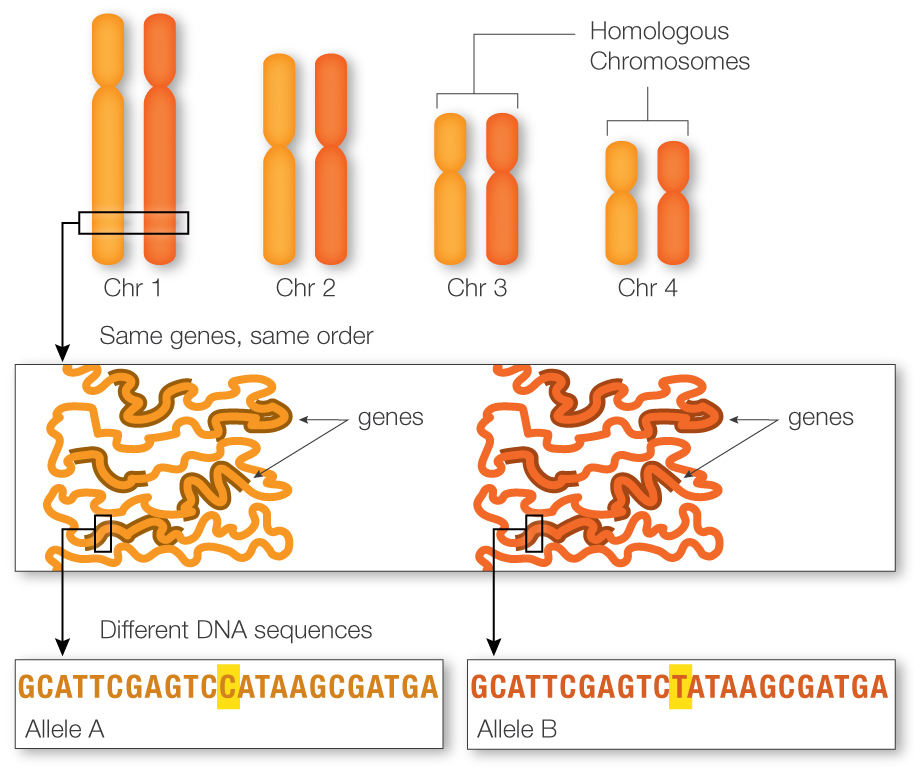

## Изследване на случайните ефекти върху генетичната структура на популации

### 0. Интро

Алелите представляват различните състояния на даден ген (различни комбинации от нуклеиновите киселини наблюдавани на едно и също място в ДНК веригата - локус), които определят различни фенотипни (външни/видими) белези:

Например, [OCA2 Gene](https://www.geneheritage.com/ref/genes/OCA2.html?type=sri) генът определя цвета на очите до голяма степен (по-точно определя количеството меланин - по-малко меланин => по-светли очи, по-светла кожа и коса и тн) и са известни 3 негови състояния (алели) - Light (T-G комбинация), Dark (C-A комбинация) и Other (C-G комбинация). Това са примерни наименования, важното е че има 3 алела (разновидности) на този ген. 

В популационната и еволюционна генетика, а дори и в повечето генетични изследвания, честота на алелите на дадени гени е от голямо значение.

 

### 1. Изследване на генотипа на бъдещите поколения

Идеята е имайки честотите на алелите в даден локус за поколение **n** да направим предказване за честотите на алелите в поколение **n + k**.

На курса по "Въведение в изчислителната биология" правихме много базов модел - https://github.com/Beatris/biomath_models/blob/master/Stochastic%20Population%20Genetics%20Basic%20Models.ipynb

В този модел обаче разглеждаме честотите като фиксирани точки, а не като случайни величини.
Затова искам да направя **Monte Carlo симулация, която да ни даде разпределението на честотите на алелите след k поколения**.

 

### 2. Бейсов модел за генетичната структура на популация

Тук идеята е имайки генотипа на няколко индивида да съставим разпределението на честотите на различните алели в популацията.
Като разпределението ще го апроксимирам с MCMC.

Моделът може да бъде разширен по много начини, ако ми остане достатъчно време. Например да се прави нещо като clustering analysis, т.е. да можем да идентифицираме подпопулации. Може също така да се предсказва разпределението на inbreeding параметър и много други...
